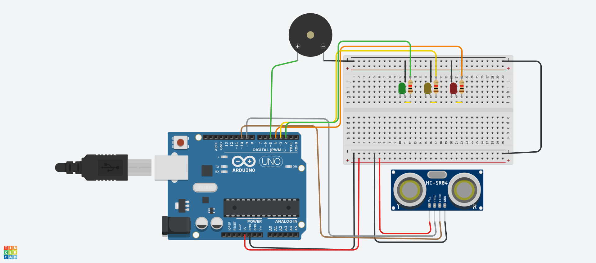
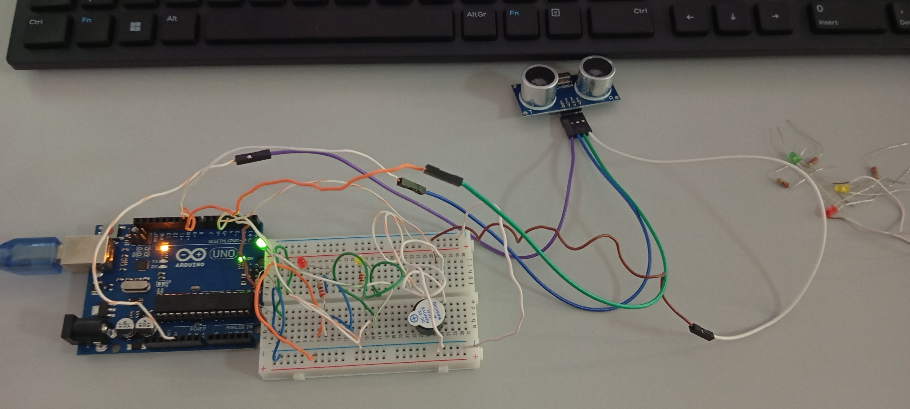

# 🚗 Sensor de Estacionamento com Arduino

Este projeto consiste em um **Sensor de Ré/Estacionamento** automotivo desenvolvido utilizando a plataforma Arduino. O sistema mede a distância de objetos em tempo real utilizando um sensor ultrassônico e alerta o motorista visualmente (através de LEDs) e sonoramente (através de um buzzer) conforme a proximidade do obstáculo.








---

## 📌 Funcionalidades

* **Leitura em Tempo Real:** Medição precisa da distância de objetos em centímetros.
* **Alertas Visuais:** Escala de 3 LEDs (Verde, Amarelo e Vermelho) indicando o nível de proximidade.
* **Alertas Sonoros:** Frequência de bipes do buzzer adaptável (quanto mais perto, mais rápido o som).
* **Logs no Monitor Serial:** Exibição em tempo real das distâncias e do status do sistema para fins de depuração.

---

## 🛠️ Componentes Utilizados

* 1x Arduino UNO (ou placa compatível)
* 1x Sensor Ultrassônico HC-SR04
* 1x LED Verde
* 1x LED Amarelo
* 1x LED Vermelho
* 3x Resistores de $220\ \Omega$ (para proteção dos LEDs)
* 1x Buzzer Piezoelétrico
* 1x Protoboard
* Cabos Jumpers para conexões

---

## 🔌 Esquema de Ligação (Pinagem)

Abaixo estão as conexões necessárias para o funcionamento do projeto conforme configurado no código:

| Componente | Pino no Componente | Pino no Arduino |
| :--- | :--- | :--- |
| **Sensor HC-SR04** | VCC | 5V |
| | Trig | Pino Digital 9 |
| | Echo | Pino Digital 10 |
| | GND | GND |
| **LED Verde** | Anodo (+) | Pino Digital 2 (com Resistor $220\ \Omega$) |
| **LED Amarelo** | Anodo (+) | Pino Digital 3 (com Resistor $220\ \Omega$) |
| **LED Vermelho** | Anodo (+) | Pino Digital 4 (com Resistor $220\ \Omega$) |
| **Buzzer** | Positivo (+) | Pino Digital 5 |
| | Negativo (-) | GND |

---

## 📊 Tabela de Lógica de Distâncias

O comportamento do sistema varia de acordo com a distância detectada pelo sensor:

| Distância Detectada | LED Aceso | Comportamento do Buzzer | Status no Log |
| :--- | :--- | :--- | :--- |
| **Mais de 30 cm** | Nenhum | Totalmente em silêncio | `LIVRE` |
| **Entre 16 e 30 cm** | 🟢 Verde | Apita pausadamente (Lento) | `ATENÇÃO` |
| **Entre 6 e 15 cm** | 🟡 Amarelo | Apita rapidamente (Rápido) | `CUIDADO` |
| **5 cm ou menos** | 🔴 Vermelho | Som contínuo (Sem parar) | `PERIGO ABSOLUTO!` |

---

link do video: https://drive.google.com/drive/folders/15xnKfl9vn-sw0NfomUYr0w117CpGmH8E?usp=sharing
link do projeto online: https://www.tinkercad.com/things/1MHWjEwDiCw-sensor-de-presenca?sharecode=tTv2p2sGkmTSN1Bnewto95VcR2DotbZ732AB-WVBAm0

## 💻 Exemplo de Log no Monitor Serial

Ao abrir o Monitor Serial configurado em **9600 Baud**, você verá o seguinte comportamento:

```text
=========================================
  SISTEMA INICIALIZADO: SENSOR DE RÉ     
=========================================
[LOG] Distancia atual: 45 cm | Status: LIVRE - Tudo apagado
[LOG] Distancia atual: 22 cm | Status: ATENÇÃO - LED Verde Ligado
[LOG] Distancia atual: 11 cm | Status: CUIDADO - LED Amarelo Ligado
[LOG] Distancia atual: 3 cm | Status: PERIGO ABSOLUTO! - LED Vermelho e Buzzer Continuo
